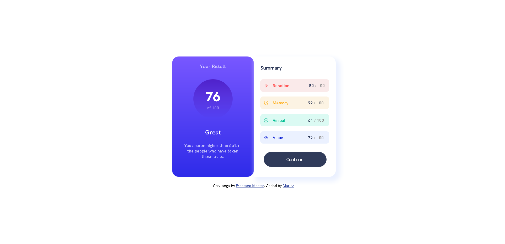
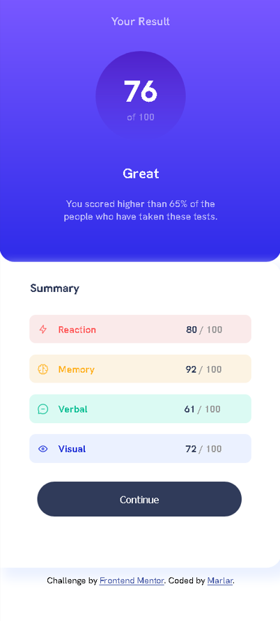
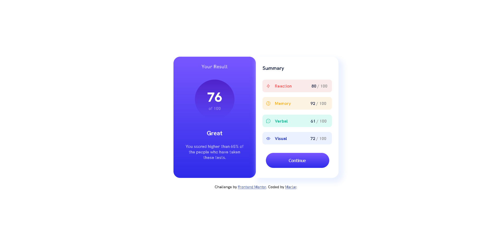

# Frontend Mentor - Results summary component solution

This is a solution to the [Results summary component challenge on Frontend Mentor](https://www.frontendmentor.io/challenges/results-summary-component-CE_K6s0maV). Frontend Mentor challenges help you improve your coding skills by building realistic projects. 

## Table of contents

- [Overview](#overview)
  - [The challenge](#the-challenge)
  - [Screenshot](#screenshot)
  - [Links](#links)
- [My process](#my-process)
  - [Built with](#built-with)
  - [What I learned](#what-i-learned)
  - [Useful resources](#useful-resources)
- [Author](#author)

**Note: Delete this note and update the table of contents based on what sections you keep.**

## Overview

### The challenge

Users should be able to:

- View the optimal layout for the interface depending on their device's screen size
- See hover and focus states for all interactive elements on the page

### Screenshot

- Desktop design preview

- Mobile design preview  

- Active state preview

### Links

- Solution URL: [solution URL](https://www.frontendmentor.io/solutions/result-summary-component-using-html-and-css-4w_zYLcRBQ)
- Live Site URL: [live site URL](https://marlar-tz.github.io/Result_Summary_Component/)

## My process

### Built with

- HTML responsive web design
- CSS custom properties

### What I learned

In this challenge , I learnt about aligning svg image and text using inline-block property.And also , learnt about adding gradient color in specific component.One of the main challenge for me is making the component vertically and horizontally center for responsive web page.

### Useful resources

- [CSS units](https://www.w3schools.com/cssref/css_units.php) - This helped me for aligning vertical and horizontal center for responsive web page.
- [CSS gradients](https://www.w3schools.com/css/css3_gradients.asp) - This is an amazing website to learn about types of gradient and transition.

## Author

- Github - [@marlar-tz](https://github.com/marlar-tz)
- Frontend Mentor - [@Marlar](https://www.frontendmentor.io/profile/marlar-tz)

